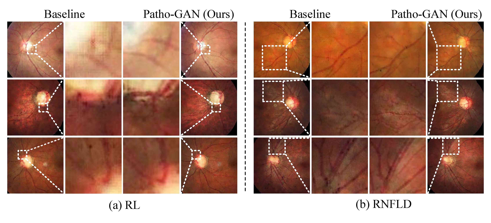

# Pathology-aware deep network visualization and its application in glaucoma image synthesis
- This is the official repository of the paper "Pathology-aware deep network visualization and its application in glaucoma image synthesis" from **MICCAI 2019**[[Paper Link]](https://link.springer.com/chapter/10.1007/978-3-030-32239-7_47, "Paper Link")[[PDF Link]](https://link.springer.com/content/pdf/10.1007%2F978-3-030-32239-7_47.pdf)


## 1. Environment
- Python >= 3.5
- Tensorflow >= 1.4 is recommended
- opencv-python
- sklearn
- matplotlib
- matlab


## 2. Dataset

1. The training and test fundus images are from the [[LAG-database]](https://github.com/smilell/AG-CNN, "Official SIGF"). 

2. The vessel images corresponding to the fundus images can be generated using the method in the paper [[Vessel_segment]](file:///D:/download/2018-xianchneng-retina_blood_vessel.pdf). A recent re-implementation of the method can be seen in [[retina-segmentation-unet]](https://github.com/arthuraaL/retina-segmentation-unet)


3. Obtain the ground-truth for visualization from [[dropbox]](https://www.dropbox.com/s/bbsxsq1qhyezfxn/bbox.zip?dl=0). 

4. Put the data into the directory-tree of 

```
./img_data/OURS/image(vessel)(label)
```


## 3. Prepare

Refer to the `data_processing.py` to generate the `.tfrecord` files.


## 4. Training and validation

```
    python main.py 
```

## 5. Results Display

Actually, there are two tasks as described in our paper, i.e., the network visualization task and image synthesis task. As a result, here we show 
some subjective results of thes two tasks. 
1. The network visualization results 

   

2. The image synthesis results 

   

## 6. Citation
If you find our work useful in your research or publication, please cite our work:
```
@inproceedings{wang2019pathology,
  title={Pathology-aware deep network visualization and its application in glaucoma image synthesis},
  author={Wang, Xiaofei and Xu, Mai and Li, Liu and Wang, Zulin and Guan, Zhenyu},
  booktitle={International Conference on Medical Image Computing and Computer-Assisted Intervention},
  pages={423--431},
  year={2019},
  organization={Springer}
}
```

## 7. Contact

If you have any questions, please contact [xfwang@buaa.edu.cn]

